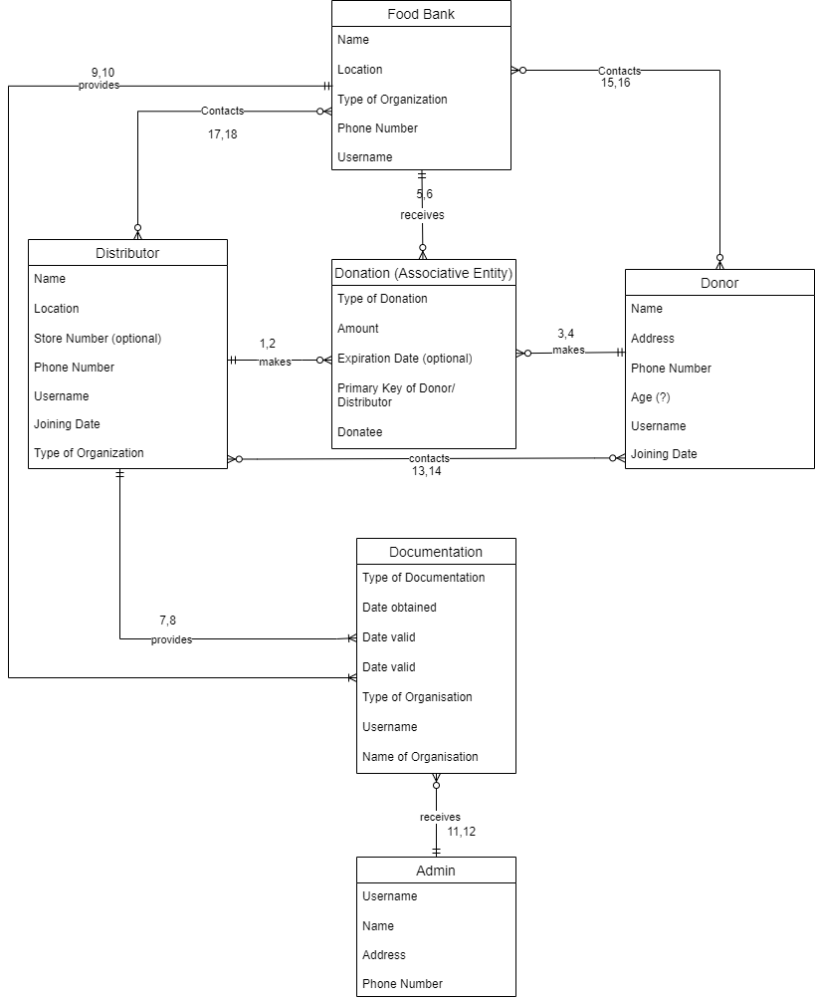

# project-milestones
For working with each project milestone 

P1 - A Fresh Page: Creating a Data Model

Data Sources:
1. Meeting notes from our Meeting
2. Document shared by the client (We are still waiting for the document to be shared)

Entities & Descriptions:

1. Donor - people who wants to donate; name, address, phone number, age?, username, date joined
2. Distributor - any bigger organization/ farmer that would want to donate food to second hand distributors (ex: Walmart); name, location, store number, phone number, username, type of organization, date joined
3. Food bank/pantry - organizations that are taking in donations; name, location, phone number, username, type of organization, date joined
4. Donation - The donations that are received; type of donation, amount/weight (optional), expiration (optional), Distributor/Donor username, Donate username
5. Documentation - Stores legal documents regarding food banks and distributors for certification, etc. (ex. Proof of identity/legitimacy); type of documentation, date obtained, date valid, type of organization, name of organization, username
6. Admin - Dr. Page, someone who can view and manage; name, username, address, phone number

Business Rules:

1. A distributor may optionally make many donations.
2. A donation is made by one and only one distributor.
3. A donor may optionally make many donations.
4. A donation is made by one and only one donor.
5. A food bank may optionally receive many donations.
6. A donation is received by one and only one food bank.
7. A distributor must provide one or many documents.
8. A document is provided by one and only one distributor.
9. A food bank must provide one or many documents.
10. A document is provided by one and only one food bank.
11. An admin may optionally receive many documents.
12. A document will be received by one and only one admin.
13. A distributor may optionally contact many donors.
14. A donor may optionally contact many distributors.
15. A donor may optionally contact many food banks.
16. A food bank may optionally contact many donors.
17. A food bank may optionally contact many distributors.
18. A distributor may optionally contact many food banks.

[Google Doc for ERD + Bussiness Rules](https://docs.google.com/document/d/1ybDSIRTjVTnCF4mJB89i41WM6z4zlfJB6mOm6C3Yo6Y/edit?usp=sharing)
